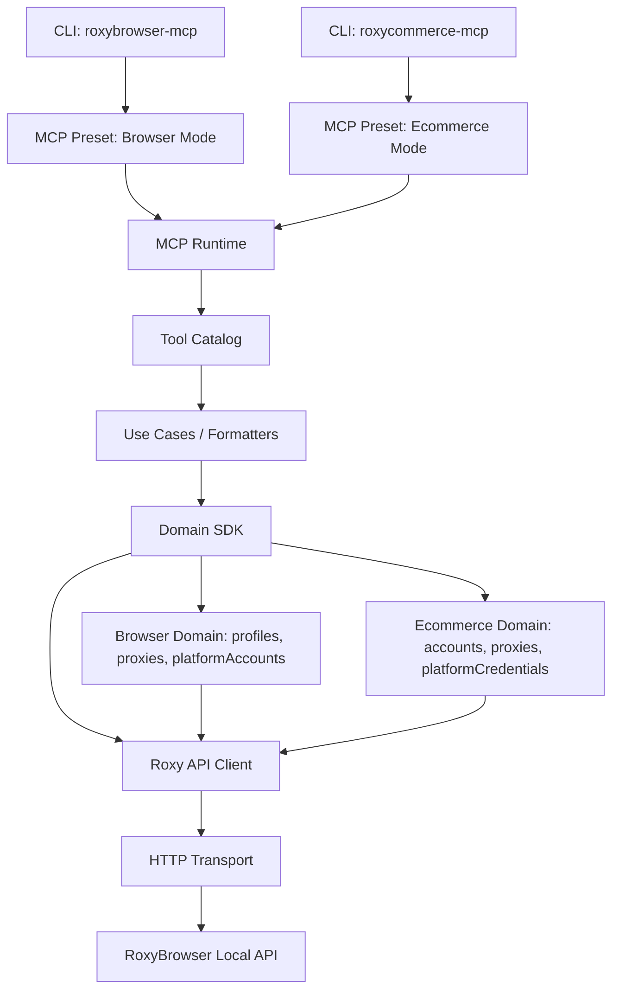

# RoxyBrowser OpenAPI 3.0 Architecture

## Goals

RoxyBrowser OpenAPI 3.0 is a breaking redesign. The codebase separates raw RoxyBrowser API access from SDK domain language and from MCP tool presets.

The immediate goals are:

- Use one low-level HTTP/OpenAPI client for all requests.
- Expose clean SDKs whose methods do not look like backend endpoints.
- Keep SDK method names, MCP tool names, and backend endpoints separate.
- Support multiple MCP product shapes from the same API client.
- Support the standard RoxyBrowser model and the ecommerce model, where the same underlying browser-window APIs are presented as ecommerce accounts.
- Target 90% or higher unit-test coverage for the rewritten layers.

## Layering



## Directory Structure

```txt
src/
  api/
    errors.ts
    index.ts
    roxy-api-client.ts
    transport.ts
    types.ts

  sdk/
    index.ts
    roxy-browser-client.ts
    roxy-commerce-client.ts
    shared/
      ids.ts
      normalize.ts
      pagination.ts
      result.ts

  domains/
    browser/
      index.ts
      platform-accounts.ts
      profiles.ts
      proxies.ts
      types.ts
      workspaces.ts
    commerce/
      accounts.ts
      index.ts
      platform-credentials.ts
      proxies.ts
      types.ts

  mcp/
    runtime/
      create-server.ts
      index.ts
      types.ts
    presets/
      browser/
        create-browser-mcp-server.ts
        formatters.ts
        index.ts
        tools.ts
      commerce/
        create-commerce-mcp-server.ts
        formatters.ts
        index.ts
        tools.ts

  cli/
    browser.ts
    commerce.ts

  index.ts
```

The 3.0 tree contains only the rewritten API, SDK, domain, MCP, and CLI layers. New MCP presets must live under `src/mcp/presets/*`.

## Naming Rules

Three names must remain distinct:

- Backend endpoint: `POST /browser/open`
- SDK operation: `roxy.profiles.open(id, options)`
- MCP tool: `roxy_profile_open`

Each MCP tool should carry debug metadata:

```ts
{
  name: 'roxy_account_open',
  operationId: 'commerce.account.open',
  endpoint: 'POST /browser/open',
}
```

This makes incident debugging explicit:

```txt
tool: roxy_account_open
operation: commerce.account.open
endpoint: POST /browser/open
dirId/profileId: xxx
```

## Low-Level API

The low-level API client only models RoxyBrowser's local HTTP API. It may keep method names close to raw endpoints, but it is not the recommended user-facing SDK.

Example:

```ts
api.browser.create(rawParams);
api.browser.modify(rawParams);
api.browser.open(rawParams);
api.browser.list(rawParams);

api.proxy.listMerged(rawParams);
api.proxy.create(rawParams);
api.proxy.batchCreate(rawParams);

api.account.create(rawParams);
api.account.batchCreate(rawParams);
```

## Browser SDK

The standard SDK is the public API for the normal RoxyBrowser product shape.

```ts
import { RoxyBrowserClient } from "@roxybrowser/openapi";

const roxy = new RoxyBrowserClient({
  apiKey: "xxxx",
  baseUrl: "http://127.0.0.1:50000",
  workspaceId: 19744,
});

const profiles = await roxy.profiles.list({
  page: 1,
  pageSize: 20,
  projectIds: [1, 2],
  name: "test",
});

const profile = await roxy.profiles.create({
  name: "TikTok Account A",
  projectId: 1,
  core: { type: "Chrome", version: "140" },
  os: { name: "Windows", version: "11" },
  proxyId: 395935,
  urls: ["https://www.tiktok.com"],
});

const opened = await roxy.profiles.open(profile.id, {
  force: true,
  args: ["--disable-audio-output"],
});

await roxy.profiles.close(profile.id);
await roxy.profiles.delete([profile.id], { soft: true });
```

### Browser SDK Surface

```ts
roxy.workspaces.list(params?)
roxy.projects.list(params?)

roxy.profiles.list(params?)
roxy.profiles.get(id)
roxy.profiles.create(input)
roxy.profiles.update(id, patch)
roxy.profiles.delete(ids, options?)
roxy.profiles.open(id | ids, options?)
roxy.profiles.close(id | ids)
roxy.profiles.connectionInfo(ids?)
roxy.profiles.randomizeFingerprint(id)
roxy.profiles.clearLocalCache(ids, options?)
roxy.profiles.clearServerCache(ids)

roxy.proxies.list(params?)
roxy.proxies.get(id)
roxy.proxies.create(input)
roxy.proxies.createMany(inputs)
roxy.proxies.update(id, patch)
roxy.proxies.delete(ids)
roxy.proxies.detect(id)
roxy.proxies.detectChannels()

roxy.platformAccounts.list(params?)
roxy.platformAccounts.create(input)
roxy.platformAccounts.createMany(inputs)
roxy.platformAccounts.update(id, patch)
roxy.platformAccounts.delete(ids)

roxy.labels.list()
```

## Ecommerce SDK

The ecommerce SDK exposes ecommerce account language while using the same underlying browser profile APIs.

```ts
import { RoxyCommerceClient } from "@roxybrowser/openapi";

const commerce = new RoxyCommerceClient({
  apiKey: "xxxx",
  baseUrl: "http://127.0.0.1:50000",
  workspaceId: 19744,
});

const accounts = await commerce.accounts.list({
  page: 1,
  pageSize: 20,
  keyword: "shop-a",
});

const account = await commerce.accounts.create({
  name: "Amazon Store A",
  projectId: 1,
  platform: {
    url: "https://sellercentral.amazon.com",
    username: "seller@example.com",
    password: "xxxx",
  },
  proxyId: 395935,
});

const session = await commerce.accounts.open(account.id, {
  force: true,
});

await commerce.accounts.close(account.id);
```

## Parameter Style

The SDK must use business naming and hide backend snake_case.

```ts
type Pagination = {
  page?: number;
  pageSize?: number;
};

type Sort = {
  sortBy?: string;
  sortOrder?: "asc" | "desc";
};

type ProxyListParams = Pagination &
  Sort & {
    source?: "user" | "store" | "all";
    type?: "available" | "all";
    bindStatus?: "bound" | "unbound" | "all";
    autoRenew?: boolean;
    country?: string;
    checkStatus?: "passed" | "failed" | "unknown";
  };
```

Mappings to raw API parameters:

```txt
page -> page_index
pageSize -> page_size
source: user -> proxyType=0
source: store -> proxyType=1
type: available -> type=available_list
sortBy -> orderName
sortOrder -> orderType
```

## MCP Tool Names

Browser mode exposes 27 tools:

```txt
roxy_workspace_list
roxy_project_list
roxy_label_list
roxy_profile_list
roxy_profile_get
roxy_profile_create
roxy_profile_update
roxy_profile_open
roxy_profile_close
roxy_profile_delete
roxy_profile_connection_info
roxy_profile_randomize_fingerprint
roxy_profile_clear_local_cache
roxy_profile_clear_server_cache
roxy_proxy_list
roxy_proxy_get
roxy_proxy_create
roxy_proxy_create_many
roxy_proxy_update
roxy_proxy_delete
roxy_proxy_detect
roxy_proxy_detect_channels
roxy_platform_account_list
roxy_platform_account_create
roxy_platform_account_create_many
roxy_platform_account_update
roxy_platform_account_delete
```

Ecommerce mode exposes 20 tools:

```txt
roxy_account_list
roxy_account_get
roxy_account_create
roxy_account_update
roxy_account_open
roxy_account_close
roxy_account_delete
roxy_proxy_list
roxy_proxy_get
roxy_proxy_create
roxy_proxy_create_many
roxy_proxy_update
roxy_proxy_delete
roxy_proxy_detect
roxy_proxy_detect_channels
roxy_platform_credential_list
roxy_platform_credential_create
roxy_platform_credential_create_many
roxy_platform_credential_update
roxy_platform_credential_delete
```

## Rewrite Order

1. Create `src/api` and move the raw HTTP client there as `RoxyApiClient`.
2. Create `src/sdk/RoxyBrowserClient`.
3. Create `src/domains/browser/*` and cover profiles, proxies, platform accounts, labels, and workspaces.
4. Keep only the rewritten API, SDK, domain, MCP, and CLI layers.
5. Rewrite `src/mcp/presets/browser/tools.ts`.
6. Create `src/sdk/RoxyCommerceClient`.
7. Create `src/mcp/presets/commerce/tools.ts`.
8. Add separate CLI entries for browser and commerce MCPs.
9. Add colocated unit tests and coverage reporting.
10. Keep the package, README, examples, and tests aligned to the 3.0 surface only.
